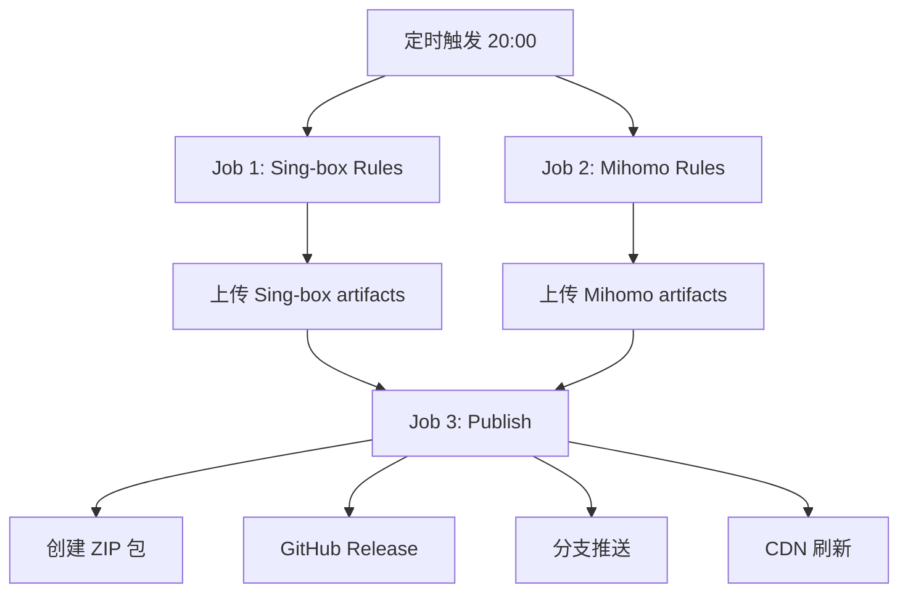

# Rule Singbox Mihomo

**Mihomo** 的网络规则文件

## 🚀 特色功能

### ⚡ 并行构建架构
- **2x 构建速度**: Sing-box 和 Mihomo 规则并行生成
- **资源隔离**: 每个Job独立运行，互不干扰
- **一键发布**: 统一Release包含所有格式规则

### 🎯 Sing-box 规则
- **完整版**: 支持所有规则类型，适合高级用户
- **Lite版**: 仅包含 IP-CIDR + DOMAIN，体积更小，加载更快
- **双格式**: JSON 源码 + SRS 二进制，满足不同需求

### 🛡️ Mihomo 规则
- **YAML格式**: 默认格式，兼容性最好
- **LIST格式**: 纯文本列表，加载速度 3x 更快  
- **MRS格式**: 实验性二进制格式

## 📦 获取方式

### 🎯 ZIP包下载 (推荐)
访问 [Releases页面](../../releases/latest) 下载：

#### Sing-box 规则包
- `sing-rules-srs.zip` - 完整版 (.srs 二进制)
- `sing-rules-json.zip` - 完整版 (.json 源码)  
- `sing-rules-lite-srs.zip` - 精简版 (.srs 二进制)
- `sing-rules-lite-json.zip` - 精简版 (.json 源码)

#### Mihomo 规则包  
- `meta-rules-yaml.zip` - YAML 格式
- `meta-rules-list.zip` - LIST 格式 (推荐)
- `meta-rules-mrs.zip` - MRS 格式

### 🌐 CDN 直链访问
```bash
# GitHub Raw (稳定)
https://raw.githubusercontent.com/proother/rule_singbox_mihomo/refs/heads/release/

# jsDelivr CDN (加速)  
https://cdn.jsdelivr.net/gh/proother/rule_singbox_mihomo@release/
```

### 🌳 分支访问
- **release**: 完整规则 (Sing-box + Mihomo)
- **sing**: 仅 Sing-box 规则
- **meta**: 仅 Mihomo 规则

## ⚙️ 使用方法

### Sing-box 配置示例
```json
{
    "rule_set": [
      {
      "tag": "geosite-cn",
        "type": "remote",
      "format": "binary",
      "url": "https://cdn.jsdelivr.net/gh/proother/rule_singbox_mihomo@release/sing-rule/cn.srs"
    }
  ]
}
```

### Mihomo 配置示例
```yaml
rule-providers:
  geosite-cn:
    type: http
    behavior: domain
    url: https://cdn.jsdelivr.net/gh/proother/rule_singbox_mihomo@release/meta-rule/cn.yaml
    interval: 86400
```

## 🔄 自动更新

### ⏰ 构建时间
- **北京时间**: 每日 20:00 (UTC+8)
- **UTC时间**: 每日 12:00

### 🏗️ 并行构建流程


## 📊 数据源

### 🎯 Sing-box 规则源
- **blackmatrix7/ios_rule_script** (~15,000 规则)
- 高质量规则集，适合移动设备和桌面端

### 🛡️ Mihomo 规则源  
- **GFWList** (中国大陆反审查规则)
- **China Domains** (中国大陆域名白名单)
- **Google/Apple China** (中国大陆特殊优化)
- **v2fly/domain-list-community** (~30,000 规则)

## ⚡ 性能优势

### 🚀 构建性能
- **并行构建**: 2x 构建速度
- **智能缓存**: Go modules 缓存加速
- **增量更新**: 仅更新变更规则

### 📈 运行性能
- **SRS格式**: 二进制加载，启动更快
- **LIST格式**: 纯文本解析，内存占用更少
- **去重优化**: 智能去除冗余规则

## 🛠️ 技术栈

- **GitHub Actions**: 并行CI/CD流水线
- **Go 1.22**: 高性能规则转换
- **meta-converter**: 官方格式转换工具
- **jsDelivr CDN**: 全球加速分发

## 📄 许可证

MIT License - 自由使用和修改


