# Rule Singbox Mihomo

自动生成适用于 **Sing-box** 和 **Mihomo** 的规则集，每日更新。

## ✨ 特色功能

### ⚡ 统一构建系统
- **一个Workflow，全部搞定**: 同时生成 Sing-box 和 Mihomo 规则
- **并行处理**: 2倍构建速度，独立Job互不干扰
- **统一发布**: 所有规则集中在一个Release，方便下载

### 🎯 Sing-box 规则
- **完整版**: 支持所有规则类型（~15k规则）
- **精简版 (Lite)**: 仅包含 IP-CIDR + DOMAIN，体积小90%，加载飞快
- **双格式支持**: 
  - `.json` - 人类可读，方便调试
  - `.srs` - 二进制格式，性能最优

### 🛡️ Mihomo 规则
- **三种格式任选**（~30k规则）：
  - `.yaml` - 标准格式，兼容性最好
  - `.list` - 纯文本格式，加载更快
  - `.mrs` - 二进制格式，性能最优（仅支持纯domain/ipcidr规则）

## 📦 下载使用

### 方式一：下载ZIP包（推荐）
访问 [最新Release](../../releases/latest) 下载打包好的规则集：

| 文件名 | 说明 | 适用场景 |
|--------|------|----------|
| **Sing-box 规则** |
| `sing-rules-json.zip` | 完整版JSON格式 | 需要查看/编辑规则 |
| `sing-rules-srs.zip` | 完整版SRS二进制 | 追求性能 |
| `sing-rules-lite-json.zip` | 精简版JSON格式 | 低配设备 |
| `sing-rules-lite-srs.zip` | 精简版SRS二进制 | 路由器/嵌入式设备 |
| **Mihomo 规则** |
| `meta-rules-yaml.zip` | YAML格式 | 标准用法 |
| `meta-rules-list.zip` | LIST纯文本格式 | 快速加载 |
| `meta-rules-mrs.zip` | MRS二进制格式 | 极致性能 |

### 方式二：CDN直链（在线更新）

```bash
# GitHub Raw（稳定但可能被墙）
https://raw.githubusercontent.com/proother/rule_singbox_mihomo/release/{规则文件}

# jsDelivr CDN（国内加速）
https://cdn.jsdelivr.net/gh/proother/rule_singbox_mihomo@release/{规则文件}
```

示例：
- Sing-box: `https://cdn.jsdelivr.net/gh/proother/rule_singbox_mihomo@release/sing-rule/cn.srs`
- Mihomo: `https://cdn.jsdelivr.net/gh/proother/rule_singbox_mihomo@release/meta-rule/cn.yaml`

## 📝 配置示例

### Sing-box 配置
```json
{
  "route": {
    "rule_set": [{
      "tag": "cn",
        "type": "remote",
      "format": "binary",
      "url": "https://cdn.jsdelivr.net/gh/proother/rule_singbox_mihomo@release/sing-rule/cn.srs",
      "download_detour": "direct"
    }],
    "rules": [{
      "rule_set": "cn",
        "outbound": "direct"
    }]
  }
}
```

### Mihomo 配置
```yaml
rule-providers:
  cn:
    type: http
    behavior: domain
    format: yaml  # 可选: yaml/list/mrs
    url: https://cdn.jsdelivr.net/gh/proother/rule_singbox_mihomo@release/meta-rule/cn.yaml
    interval: 86400

rules:
  - RULE-SET,cn,DIRECT
```

## 🔄 更新机制

- **更新时间**: 每日北京时间 20:00（UTC 12:00）
- **更新方式**: GitHub Actions 自动构建
- **缓存刷新**: 自动清理 jsDelivr CDN 缓存

## 📊 数据来源

| 规则集 | 数据源 | 规则数量 |
|--------|--------|----------|
| **Sing-box** | [blackmatrix7/ios_rule_script](https://github.com/blackmatrix7/ios_rule_script) | ~15,000 |
| **Mihomo** | 多源整合：GFWList + China Domains + v2fly社区 | ~30,000 |

## 🏗️ 技术架构

```mermaid
graph LR
    A[GitHub Actions<br/>北京时间 20:00] --> B[并行Job 1<br/>Sing-box规则生成]
    A --> C[并行Job 2<br/>Mihomo规则生成]
    B --> D[上传Artifacts]
    C --> D
    D --> E[发布Job<br/>整合打包]
    E --> F[GitHub Release<br/>ZIP包下载]
    E --> G[Git Push<br/>release分支]
    E --> H[CDN刷新<br/>jsDelivr]
```



### 核心优势
- **并行构建**: Sing-box 和 Mihomo 同时生成，效率翻倍
- **官方工具**: 使用 MetaCubeX 官方 meta-rules-converter
- **智能去重**: 自动去除冗余规则，优化体积
- **多格式输出**: 满足不同性能和兼容性需求

## 📈 性能对比

| 格式 | 体积 | 加载速度 | 内存占用 | 兼容性 |
|------|------|----------|----------|--------|
| JSON/YAML | 大 | 慢 | 高 | ⭐⭐⭐⭐⭐ |
| LIST | 中 | 快 | 中 | ⭐⭐⭐⭐ |
| SRS/MRS | 小 | 极快 | 低 | ⭐⭐⭐ |

## 🤝 贡献

欢迎提交 Issue 或 PR！

## 📄 许可证

MIT License


